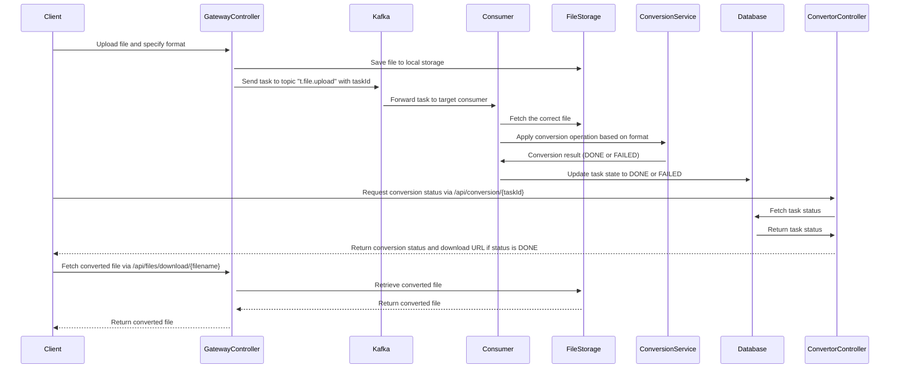

# Media Converter API

This project provides an API for multimedia conversion, allowing users to upload files, specify conversion formats, and retrieve converted files. It utilizes Spring Boot framework and Kafka for messaging.

## Workflow



## Prerequisites

Ensure you have the following installed:

- Docker
- Docker Compose
- Java Development Kit (JDK) 17 or later
- Maven

## Installation and Setup

1. Clone the repository:
   ```sh
   git clone https://github.com/bensarifathi/universal-convertor-api.git
   ```
3. Navigate to the project directory:
  ```sh
  cd media-convertor
  ```
6. Build the Docker images and start the containers:
  ```sh
  docker-compose up --build
  ```

## Usage

### Uploading Files

To upload a file for conversion, send a POST request to `/api/upload` with the file and desired format as parameters. Example:

```sh
POST /api/upload
Content-Type: multipart/form-data

file=<your-file>&format=<desired-format>
```

### Downloading Converted Files

To download a converted file, send a GET request to `/api/files/download/{filename}` with the filename as a parameter. Example:


### Retrieving Conversion Status

To check the status of a conversion task, send a GET request to `/api/convertor/{taskId}` with the task ID as a parameter. Example:

```sh
GET /api/convertor/{taskId}
```


## Configuration

- **Database Configuration**: MySQL database configuration is specified in `docker-compose.yml` under the `db` service.
- **Kafka Configuration**: Kafka configuration is specified in `docker-compose.yml` under the `kafka` service.
- **Application Configuration**: Application-specific configurations such as datasource URL, Kafka bootstrap server, and file upload path are set in `application.properties`.

## Development

- **Frameworks and Libraries**: This project is built using **Spring Boot**, **Spring Kafka**, and **Lombok**.
- **Testing**: Unit tests can be found in the `src/test` directory.

## Contributing

Contributions are welcome! Please feel free to open issues or pull requests.

## License

This project is licensed under the [MIT License](LICENSE).

---

Feel free to customize this README.md according to your project's specific details and requirements.


